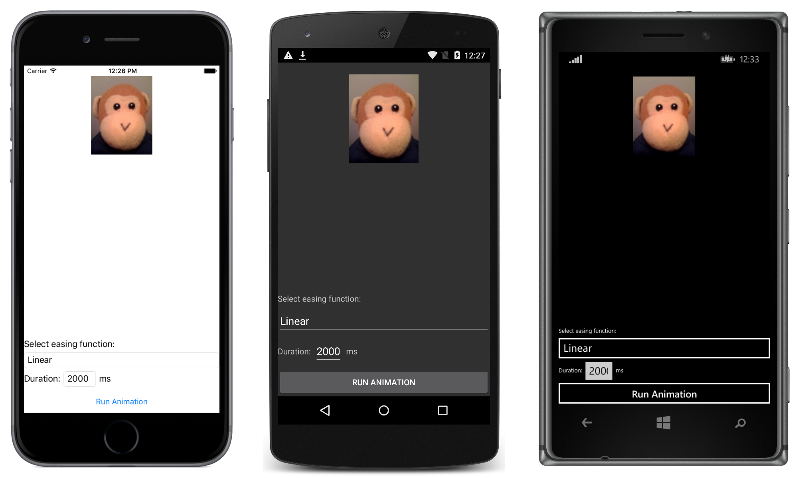

# Easing Functions

Xamarin.Forms includes an `Easing` class that allows you to specify a transfer function that controls how animations speed up or slow down as they're running. This sample demonstrates how to consume the pre-defined easing functions, and how to create custom easing functions.

For more information about the sample see [Easing Functions](http://developer.xamarin.com/guides/xamarin-forms/user-interface/animation/easing/).

## Author

David Britch
