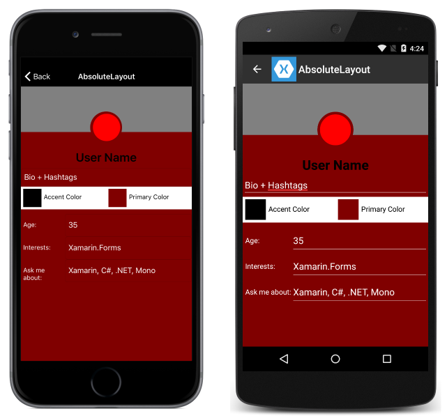

# Xamarin.Forms Layout Sample: The Business Tumble

This sample, inspired by a corporate social media profile app, demonstrates how to build similar layouts across StackLayout, RelativeLayout, and AbsoluteLayout.

