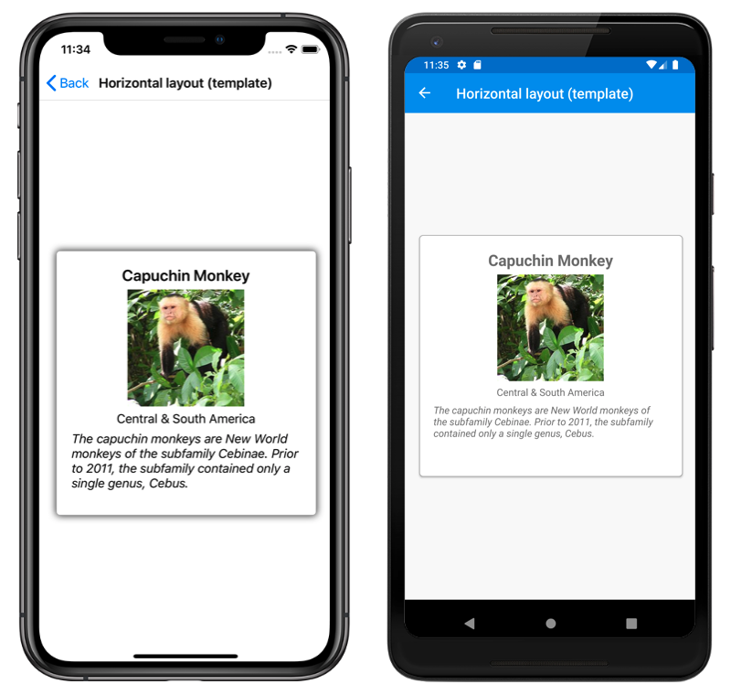

# CarouselView

This sample demonstrates how to use the Xamarin.Forms `CarouselView`.

For more information about this sample, see [Xamarin.Forms CarouselView](https://docs.microsoft.com/xamarin/xamarin-forms/user-interface/carouselview/).

