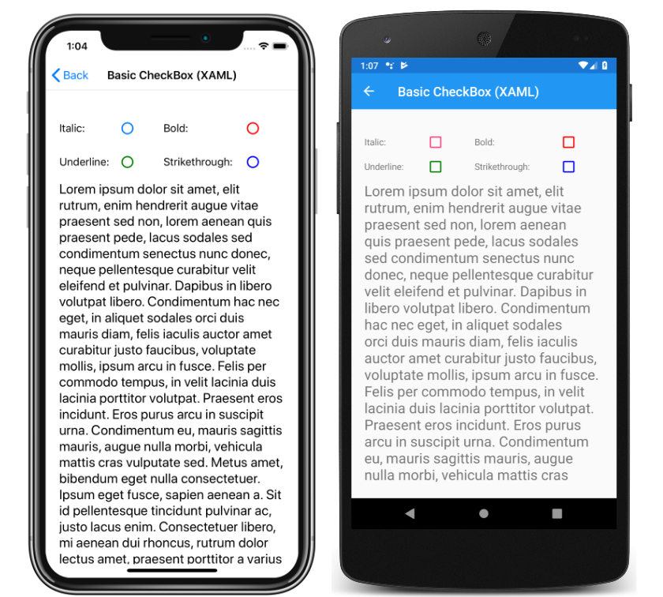

# CheckBox Demos

This sample demonstrates how to use a `CheckBox` in code, XAML with code-behind, and XAML data-binding scenarios.

For more information about this sample, see [Xamarin.Forms CheckBox](https://docs.microsoft.com/xamarin/xamarin-forms/user-interface/checkbox).

