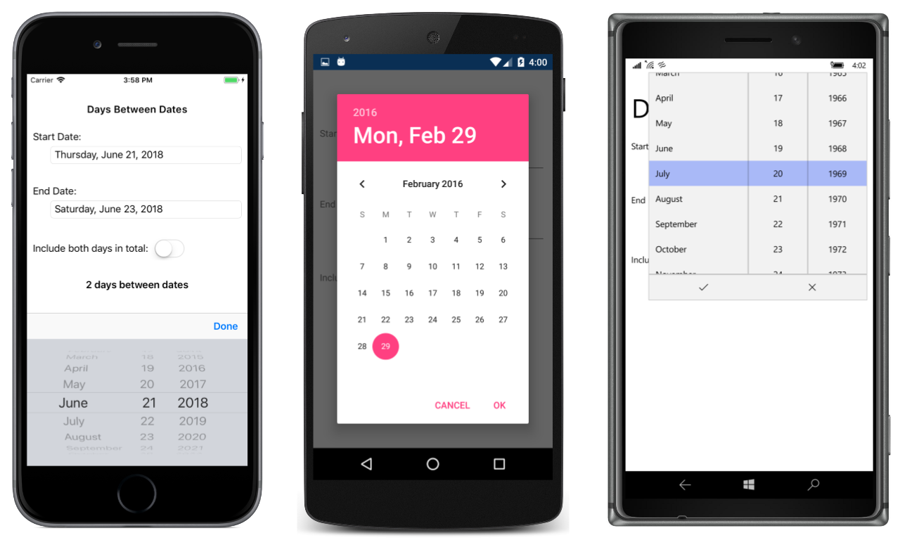

# Days Between Dates

This program uses the Xamarin.Forms DatePicker to allow the selection of two dates and then calculates the number of days between those dates.

See the article [Using DatePicker](https://docs.microsoft.com/xamarin/xamarin-forms/user-interface/datepicker) for more details.

