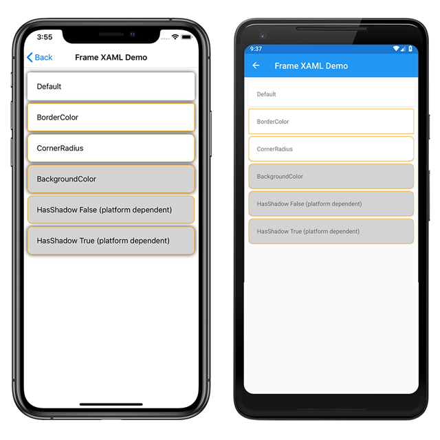

# Frame Demos

The `Frame` control is used to wrap another view with a border that can be configured with color, shadow and other options.

For more information about this sample, see [Xamarin.Forms Frame](https://docs.microsoft.com/xamarin/xamarin-forms/user-interface/frame).

## Author

Justin Johnson