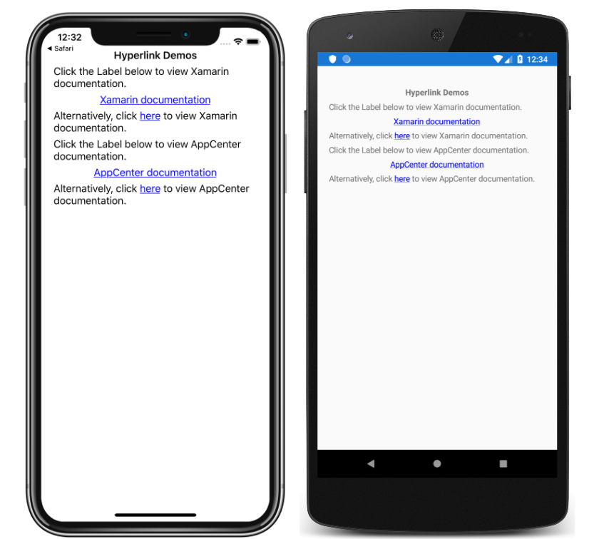

# Hyperlinks

This sample demonstrates how `Label` and `Span` instances can be turned into hyperlinks.

For more information about this sample see [Hyperlinks](https://docs.microsoft.com/xamarin/xamarin-forms/user-interface/text/label#hyperlinks).

