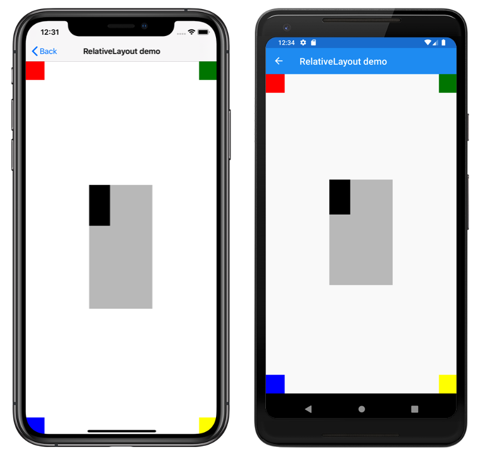

# RelativeLayout

This sample demonstrates how to use the Xamarin.Forms `RelativeLayout`.

For more information about this sample, see [Xamarin.Forms RelativeLayout](https://docs.microsoft.com/xamarin/xamarin-forms/user-interface/layouts/relativelayout).

