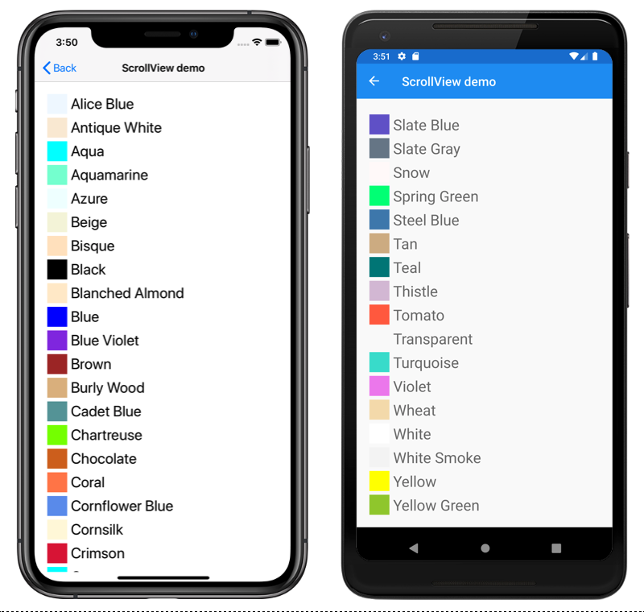

# ScrollView

This sample demonstrates how to use the Xamarin.Forms `ScrollView`.

For more information about this sample, see [Xamarin.Forms ScrollView](https://docs.microsoft.com/xamarin/xamarin-forms/user-interface/layouts/scrollview).

