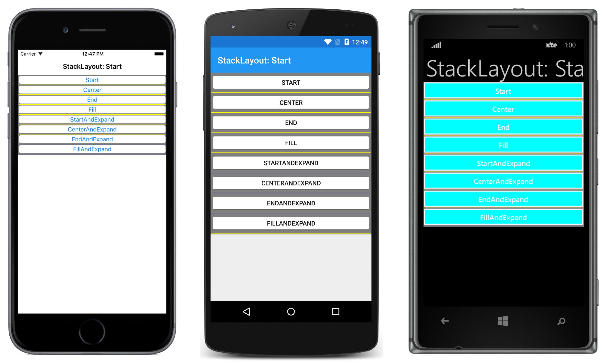

# LayoutOptions

Every Xamarin.Forms view has `HorizontalOptions` and `VerticalOptions` properties, of type `LayoutOptions`. This article demonstrates the effect that each `LayoutOptions` value has on the alignment and expansion of a view.

For more information about the sample see [LayoutOptions](http://developer.xamarin.com/guides/xamarin-forms/user-interface/layouts/layout-options/).

## Author

David Britch
