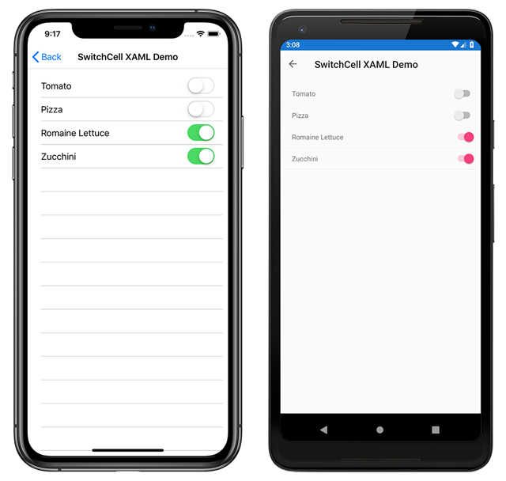

# Xamarin.Forms ListView Sample: Built-In Cells

Sample code associated with the [ListView Docs](https://docs.microsoft.com/xamarin/xamarin-forms/user-interface/listview/):

This sample demonstrates each of the built-in cell types in both XAML and C#.

Built-In Cells:

- TextCell
- ImageCell
- SwitchCell
- EntryCell

