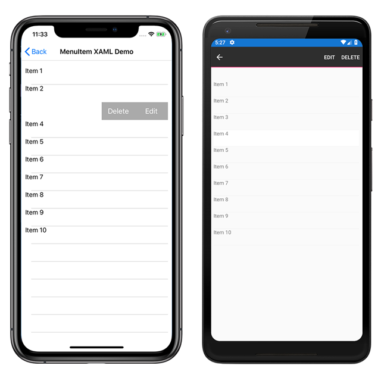

# MenuItem Demos

The `MenuItem` class is used to create menu items for menus such as `ListView` item context menus and Shell application flyout menus.

For more information about this sample, see [Xamarin.Forms MenuItem](https://docs.microsoft.com/xamarin/xamarin-forms/user-interface/menuitem).

