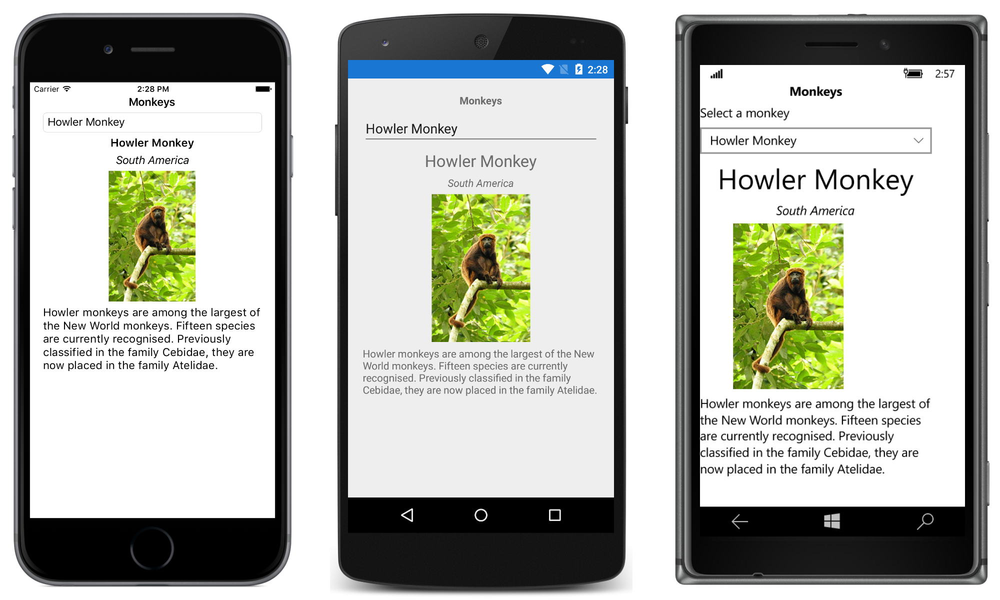

# Monkey Picker

This sample demonstrates how to populate a `Picker` with data by setting the ItemsSource property, and how to respond to item selection by the user.

For more information about this sample see [Setting a Picker's ItemsSource Property](https://developer.xamarin.com/guides/xamarin-forms/user-interface/picker/populating-itemssource/).

## Author

David Britch
