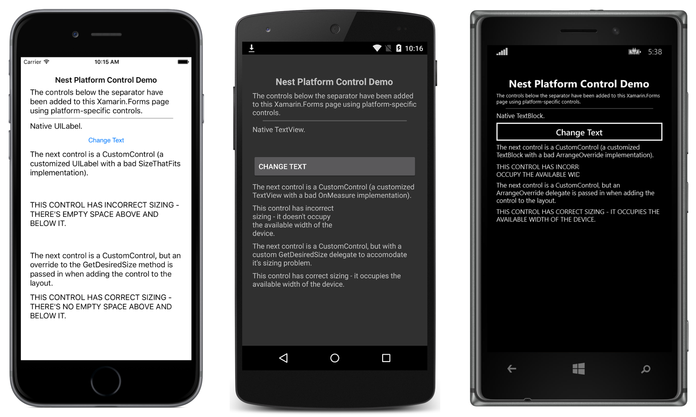

# Native Embedding

This sample demonstrates how to add platform-specific controls to a Xamarin.Forms layout, and includes how to override the layout of custom controls in order to correct their measurement API usage.

For more information about this sample see [Native Embedding](https://docs.microsoft.com/xamarin/xamarin-forms/platform/native-views/).

