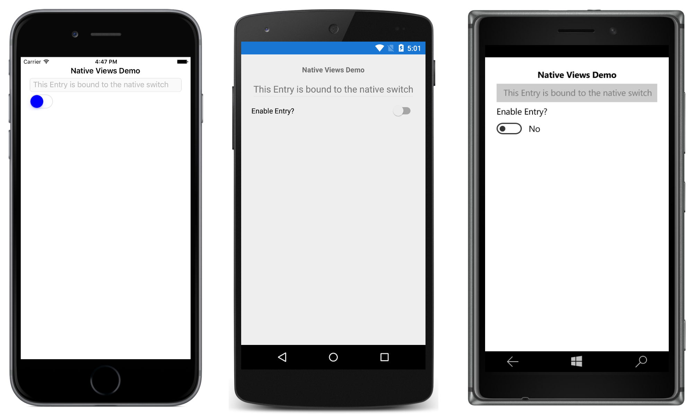

# Native Switch

This sample demonstrates how to add native views to a Xamarin.Forms page, and how they can interact with Xamarin.Forms views.

For more information about this sample see [Native Views](https://docs.microsoft.com/xamarin/xamarin-forms/platform/native-views/).

