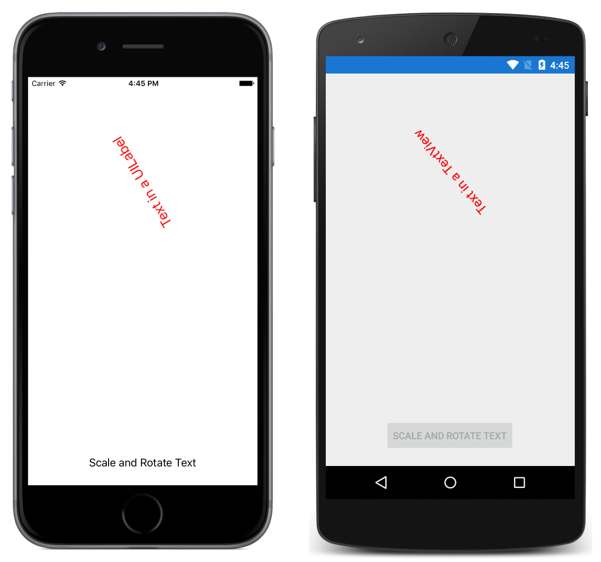

# Accessing Native Views in Code

This sample demonstrates how to refer to native views declared in XAML, from code.

For more information about this sample see [Native Views](https://docs.microsoft.com/xamarin/xamarin-forms/platform/native-views/).

