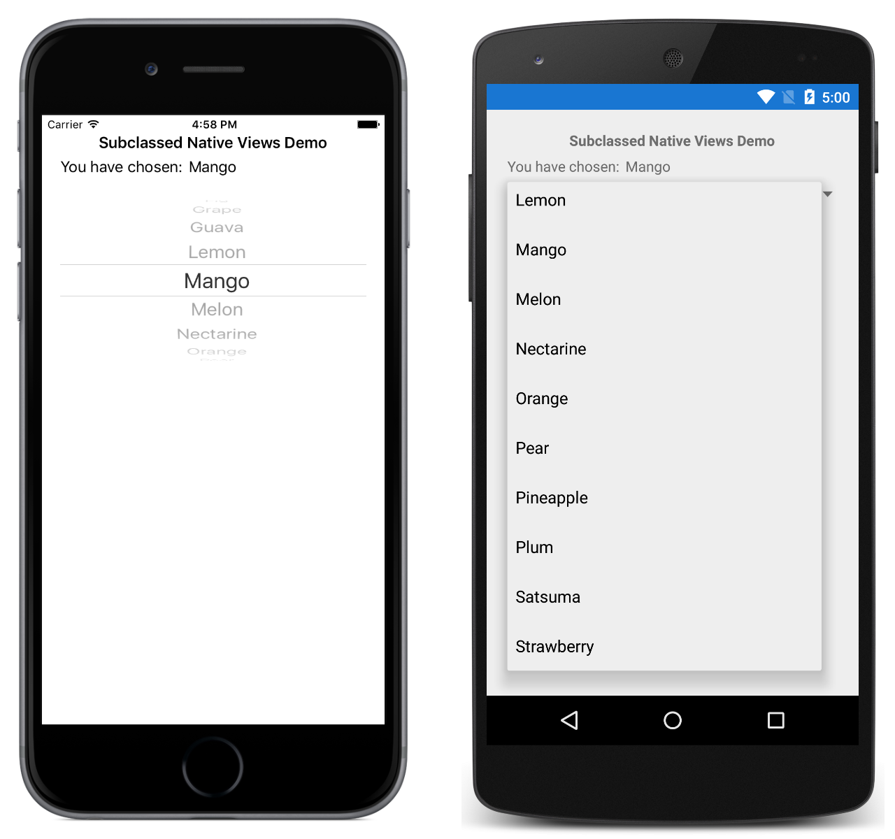

# Subclassed Native Views

This sample demonstrates how to subclass native to define a XAML-friendly API.

For more information about this sample see [Native Views](https://docs.microsoft.com/xamarin/xamarin-forms/platform/native-views/).

