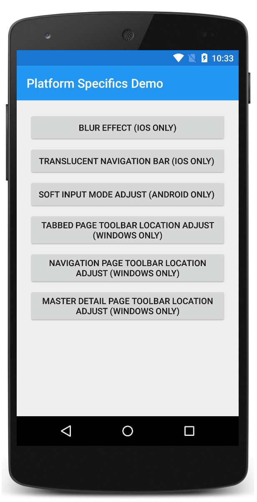

# Platform Specifics

This sample demonstrates how to consume the platform-specifics that are built into Xamarin.Forms.

For more information about this sample see [Consuming Platform-Specifics](https://docs.microsoft.com/xamarin/xamarin-forms/platform/platform-specifics/).

