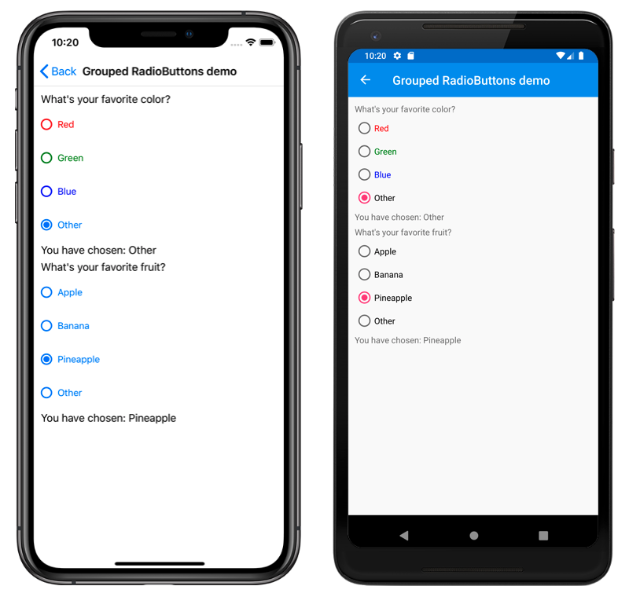

# RadioButton Demos

This sample demonstrates how to use a `RadioButton` in XAML and in code.

For more information about this sample, see [Xamarin.Forms RadioButton](https://docs.microsoft.com/xamarin/xamarin-forms/user-interface/radiobutton).

