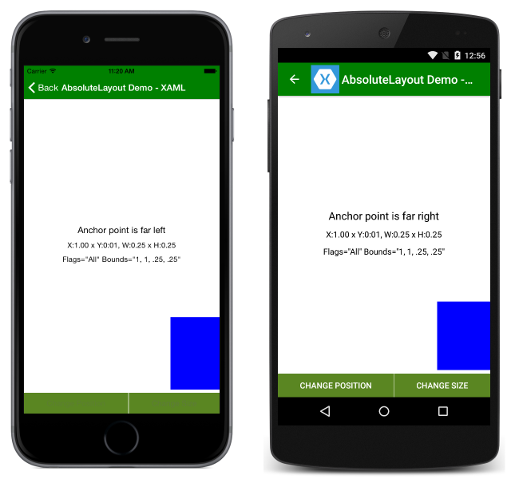

# Xamarin.Forms Layout: Handling Device Orientation

Sample code associated with the [Layout Docs](https://docs.microsoft.com/xamarin/xamarin-forms/user-interface/layouts/device-orientation):

This application demonstrates how various layouts can be used to create user interfaces that work well in multiple orientations.

