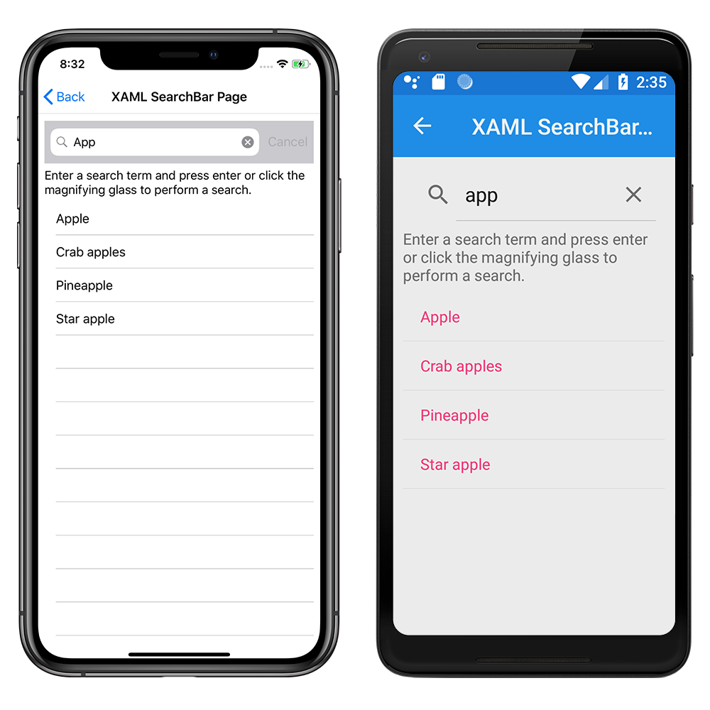

# SearchBar Demos

The SearchBar is a user input control used for initiating a search. The SearchBar control supports placeholder text, query input, execution, and cancellation. This sample demonstrates how to use a `SearchBar` to execute searches in XAML and code.

For more information about this sample, see [Xamarin.Forms SearchBar](https://docs.microsoft.com/xamarin/xamarin-forms/user-interface/searchbar).

