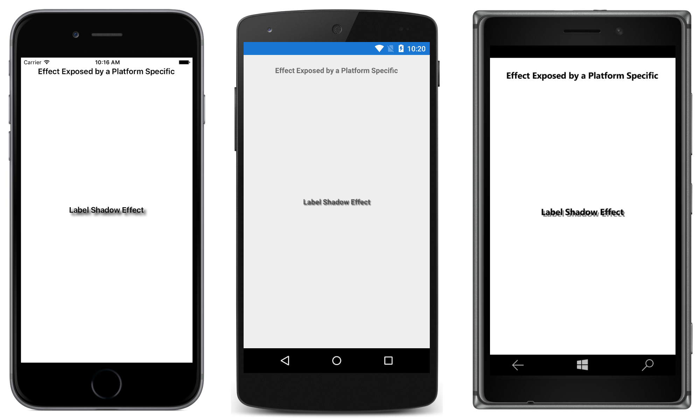

# Shadow Platform-Specific

This sample demonstrates how to expose an Effect through a platform-specific.

For more information about this sample see [Creating Platform-Specifics](https://developer.xamarin.com/guides/xamarin-forms/user-interface/platform-specifics/creating/).

## Author

David Britch
