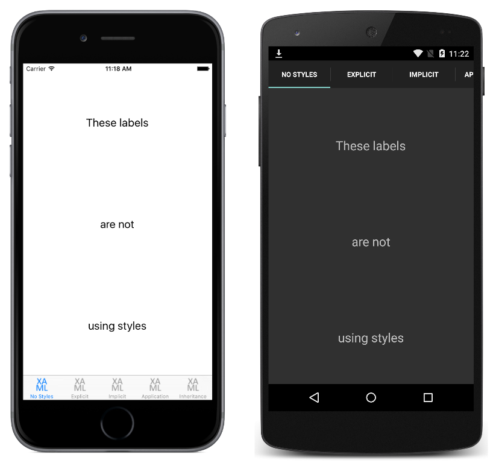

# BasicStyles

Xamarin.Forms applications often contain multiple controls that have an identical appearance. Setting the appearance of each individual control can be repetitive and error prone. Instead, styles can be created that customize control appearance by grouping and settings properties available on the control type. This sample demonstrates using the `Style` class to create styles.

For more information about the sample see [Styles](https://docs.microsoft.com/xamarin/xamarin-forms/user-interface/styles/).

