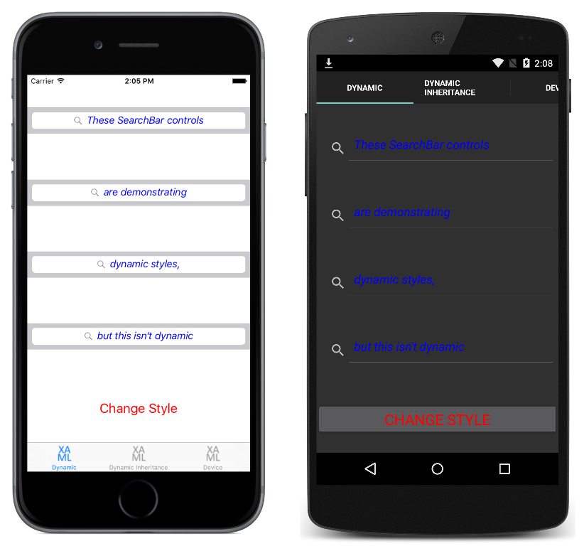

# DynamicStyles

This sample demonstrates how to use dynamic resources to make applications respond to style changes dynamically at runtime.

For more information about the sample see [Dynamic Styles](https://docs.microsoft.com/xamarin/xamarin-forms/user-interface/styles/xaml/dynamic), and [Device Styles](https://docs.microsoft.com/xamarin/xamarin-forms/user-interface/styles/xaml/device).

