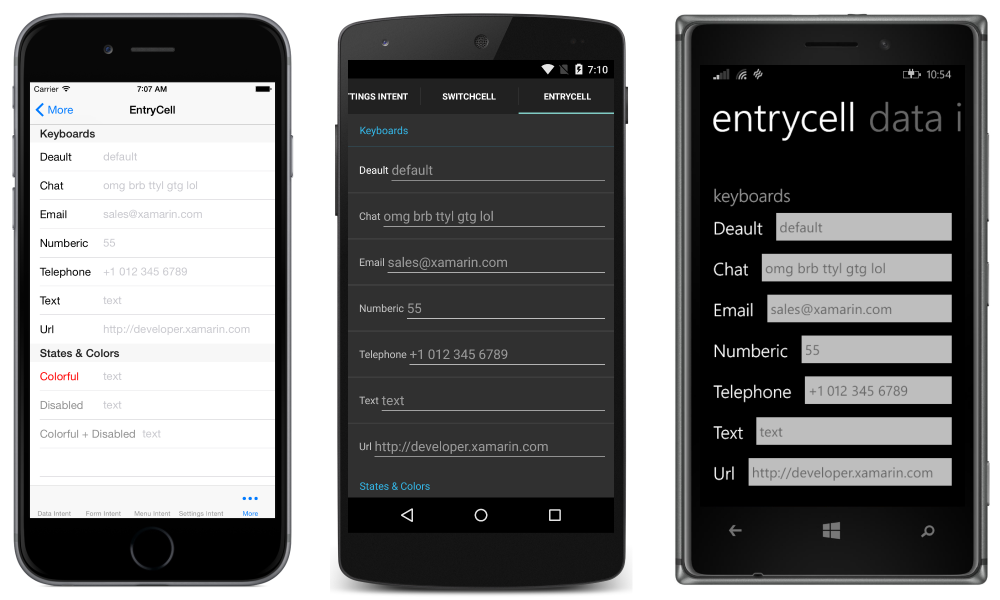

# Xamarin.Forms TableView

This sample relates to the [TableView in Xamarin.Forms](https://docs.microsoft.com/xamarin/xamarin-forms/user-interface/tableview/) doc.

The app consists of several tabs. There are four tabs with identical tables, with each demonstrating a different `TableIntent`. There is one tab demonstrating the customization options of `EntryCell`. Another tab demonstrates `SwitchCell`.

