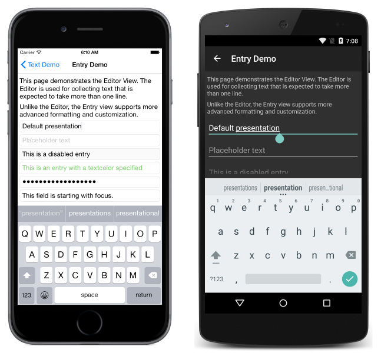

# Xamarin.Forms Text

This sample relates to the [ Text in Xamarin.Forms](http://developer.xamarin.com/guides/cross-platform/xamarin-forms/user-interface/text/) series of documents.

The app consists of several pages, demonstrating each of the text controls and a few common text entry scenarios. Each page is implemented in both XAML and C#

## Author

Nathan C. Castle
