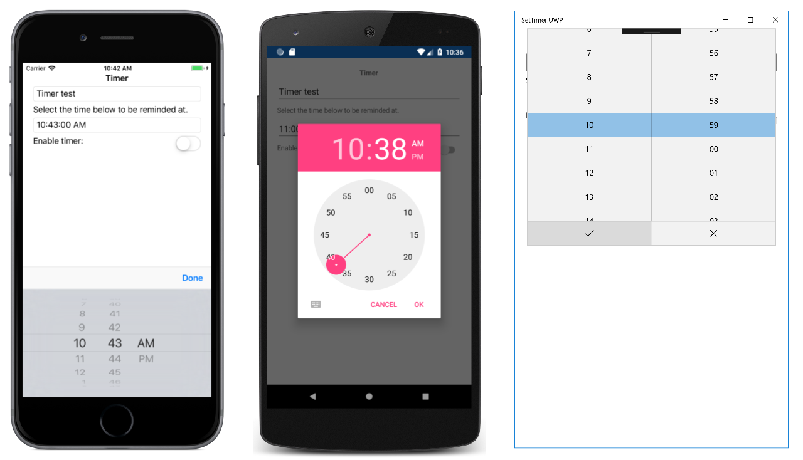

# TimePicker

This sample demonstrates how to use a `TimePicker` view to select a time, and respond to a time being selected.

For more information about this sample, see [Xamarin.Forms TimePicker](https://docs.microsoft.com/xamarin/xamarin-forms/user-interface/timepicker).

## Author

Charles Petzold / David Britch
