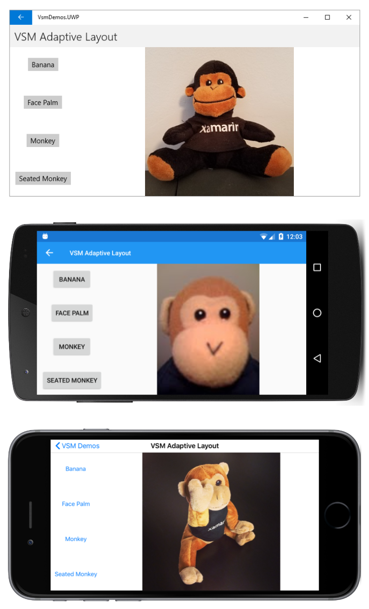

# Visual State Manager Demos

This program demonstrates features of the Visual State Manager (VSM) introduced in Xamarin.Forms 3.0. It is described in more detail in the article [The Xamarin.Forms Visual State Manager](https://docs.microsoft.com/xamarin/xamarin-forms/user-interface/visual-state-manager).

