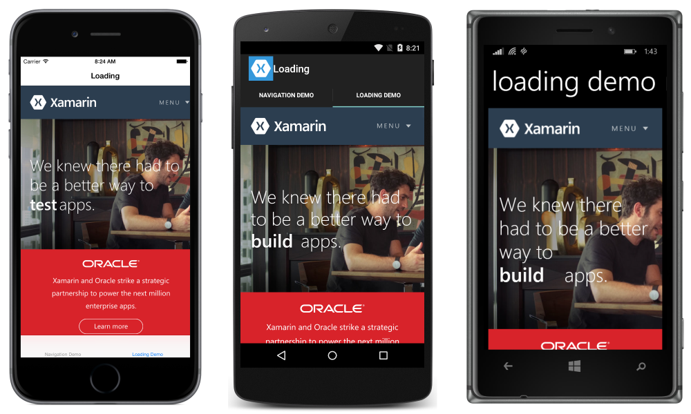

# Xamarin.Forms WebView

This sample relates to the [WebView in Xamarin.Forms](https://docs.microsoft.com/xamarin/xamarin-forms/user-interface/webview) doc.

The app consists of two tabs. One tab demonstrates how to navigate within a `WebView`, taking advantage of:

- **CanGoForward** - `true` if there is a page to navigate to, `false` otherwise.
- **GoForward** - Navigates forward.
- **CanGoBack** - `true` if there is a page to navigate back to, `false` otherwise.
- **GoBack** - Navigates back.

If there is no page to navigate back to, our sample returns to the link page. This is analogous to how many social apps will open links within a `WebView` while navigating the user back home when they are done.

The other tab demonstrates how to listen for and respond to changes in navigation state. The sample demonstrates how to implement a loading indicator, taking advantage of:

- **Navigating** - event raised when the `WebView` begins navigating to a new page.
- **Navigated** - event raised when the `WebView` has completed navigating.

