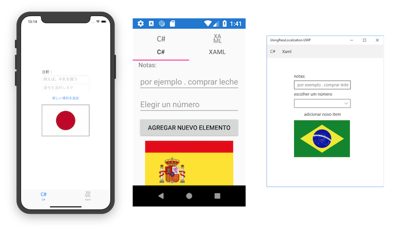

Xamarin.Forms Localization with RESX
==============

Sample code for the [Xamarin.Forms Localization](http://developer.xamarin.com/guides/cross-platform/xamarin-forms/localization) doc.

FYI: updated [language fallback information for Android 7/API 24](https://developer.android.com/guide/topics/resources/multilingual-support).

Author
------

Craig Dunn
