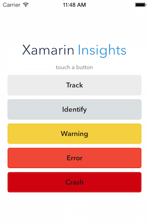
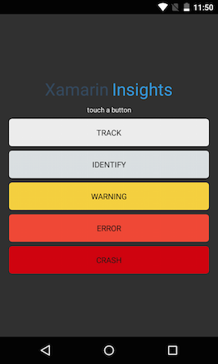

Xamarin Insights with Xamarin.Forms
================

> Xamarin Insights has been replaced by [App Center Analytics](https://docs.microsoft.com/en-us/appcenter/analytics/). This sample is for historical reference only.

*****

Sample Xamarin.Forms application for iOS and Android using [Xamarin Insights](https://insights.xamarin.com). 
You must create an Insights Application Key and paste it into the **Constants.cs** file to use this test app.

 

### Authors

Christopher Deutsch, John Miller