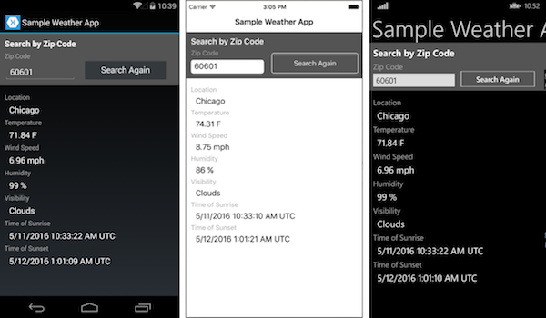

WeatherApp for Xamarin.Forms
==========

WeatherApp is an example that accompanies [Learn app-building basics with Xamarin.Forms in Visual Studio](https://msdn.microsoft.com/library/mt679501.aspx) (MSDN Library).

It consists of a PCL that contains all the UI and business logic. The platform-specific projects for Android, iOS, and Windows are the minimal app stubs.




To use this sample, you must first sign up for a free API key at [http://openweathermap.org/appid](http://openweathermap.org/appid). Paste that key in place of *YOUR API KEY HERE* in the following line of **WeatherApp/Core.cs**:

```
string key = "YOUR API KEY HERE";
```

Native Version
--------------

The equivalent app written with native UI layers, is [WeatherApp (Native)](https://github.com/xamarin/mobile-samples/tree/master/Weather).

Authors
-------

Kraig Brockschmidt, Nicole Haugen
