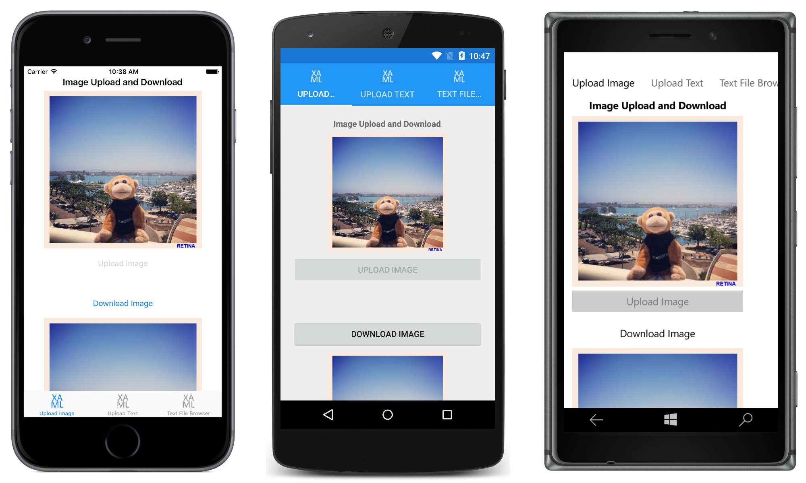

# Azure Storage

This sample demonstrates how to use Xamarin.Forms to store text and binary data in Azure Storage, and how to access the data.

For more information about this sample see [Storing and Accessing Data in Azure Storage](https://developer.xamarin.com/guides/xamarin-forms/web-services/storage/azure-storage/).

## Author

David Britch
