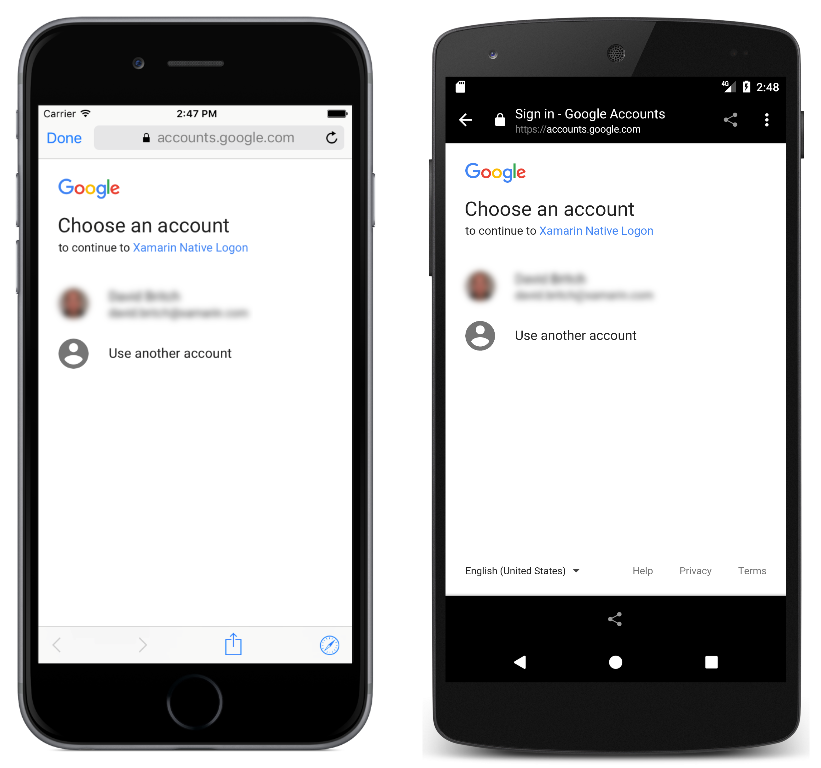

# OAuthNativeFlow

This sample demonstrates how to use Xamarin.Auth to manage a native authentication flow in a Xamarin.Forms application.

For more information about this sample see [Authenticating Users with an Identity Provider](https://developer.xamarin.com/guides/xamarin-forms/cloud-services/authentication/oauth/).

## Author

David Britch
