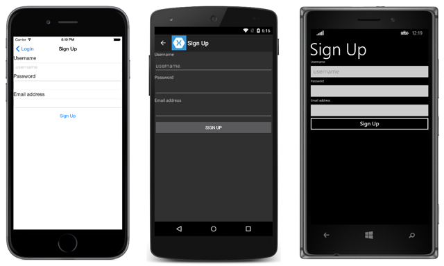
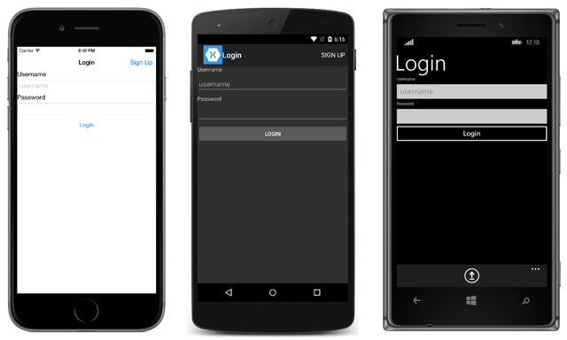

id:eb819912-4d09-4443-a589-ebfff6626293
title:Authenticating Users with a Parse Service
subtitle:Using the Parse .NET SDK in a Xamarin.Forms application
brief:The Parse .NET SDK provides classes to add user management and access control lists to an application. This article demonstrates how to add user account functionality to a Xamarin.Forms application, and how to use access control lists to limit data access to the user who created the data.
samplecode:[TodoParseAuth](/samples/xamarin-forms/WebServices/TodoParseAuth/)
article:[Consuming a Parse Service](/guides/xamarin-forms/web-services/consuming/parse/)
article:[Parse .NET + Xamarin Guide](https://parse.com/docs/dotnet/guide)
api:[Parse .NET SDK API Reference](http://parse.com/docs/dotnet/api/Index.html)
sdk:[Parse .NET SDK](https://www.nuget.org/packages/parse)
dateupdated:2016-09-20

<div class="note"><p>The Parse hosted service will be retired in early 2017. For information about migrating an app, see <a href="http://parse.com/migration">Parse Migration Guide</a> on the Parse website. For information about deploying a Parse Server to Azure, see <a href="https://azure.microsoft.com/en-us/marketplace/partners/microsoft/parseserver/">Parse Server on Managed Azure Services</a> on the Azure website.</p></div>

The [Parse .NET SDK](https://www.nuget.org/packages/parse) provides the `ParseUser` class, which is a subclass of the `ParseObject` class, which can be used to add user account functionality to an application. The `ParseUser` class includes `Username`, `Password`, and `Email` properties that are used when creating users and logging them into Parse. Data stored in a `ParseUser` instance can only be modified by the user who created the data. In addition, Parse users can also be created, updated, and deleted managed through the Parse dashboard.

Parse also provides the ability to integrate Facebook login into an application by associating an authenticated Facebook user with a `ParseUser`. For more information see [Facebook Users](https://parse.com/docs/dotnet/guide#users-facebook-users) on the Parse website.

<div class="note"><p>In iOS 9 and greater, App Transport Security (ATS) enforces secure connections between internet resources (such as the app's back-end server) and the app, thereby preventing accidental disclosure of sensitive information. Since ATS is enabled by default in apps built for iOS 9, all connections will be subject to ATS security requirements. If connections do not meet these requirements, they will fail with an exception.</p>
<p>ATS can be opted out of if it is not possible to use the <code>HTTPS</code> protocol and secure communication for internet resources. This can be achieved by updating the app's <b>Info.plist</b> file. For more information see <a href="/guides/ios/platform_features/introduction_to_ios9/ats/">App Transport Security</a>.</p></div>

# Creating Users

The sign-up screen in the sample application is shown below:



The `ParseUser.SignUpAsync` method is used to create a `ParseUser` on Parse, as shown in the following code example:

```
public async Task<bool> SignUpUserAsync (User user)
{
  ...
  var parseUser = new ParseUser () {
    Username = user.Username,
    Password = user.Password,
    Email = user.Email
  };
  await parseUser.SignUpAsync ();
  ...
}
```

This method creates a `ParseUser` instance that's initialized with the user details, and then calls the `ParseUser.SignUpAsync` method to asynchronously create the user in the connected Parse backend application. The password is stored on Parse as a password hash for security reasons. Before saving the data to Parse, the username and email are checked for uniqueness. An exception will be thrown if user creation fails, which should be handled in order to inform the user.

The `ParseUser` is cached on the mobile device when the `ParseUser.SignUpAsync` method succeeds. This cache can be treated as a session, and can be queried through the `ParseUser.CurrentUser` property, as shown in the following code example:

```
public bool IsUserLoggedIn ()
{
  if (ParseUser.CurrentUser != null) {
    return true;
  }
  else {
    return false;
  }
}
```

For more information about creating users in a Parse application, see [Signing Up](https://parse.com/docs/dotnet/guide#users-signing-up) on Parse's website.

# Logging In Users

The login screen in the sample application is shown below:



The `ParseUser.LogInAsync` method is used to login a user into their account, as shown in the following code example:

```
public async Task<bool> LoginUserAsync (User user)
{
  ...
  await ParseUser.LogInAsync (user.Username, user.Password);
  ...
}
```

An exception will be thrown if the login is unsuccessful, which should be handled in order to inform the user.

The `ParseUser` is cached on the mobile device when the `ParseUser.LogInAsync` method succeeds. This cache can be treated as a session, and can be queried through the `ParseUser.CurrentUser` property.

For more information about logging in users to a Parse application, see [Logging In](https://parse.com/docs/dotnet/guide#users-logging-in) on Parse's website.

# Logging Out Users

The `ParseUser.LogOutAsync` method is used to logout a user from Parse, as shown in the following code example:

```
public async Task LogoutAsync ()
{
  ...
  await ParseUser.LogOutAsync ();
  ...
}
```

This clears the `ParseUser` that was previously cached on the mobile device by the `ParseUser.SignUpAsync` or `ParseUser.LogInAsync` methods. Therefore, the `ParseUser.CurrentUser` property will return `null` if it's queried following a log out operation.

# Controlling Access to Data with Access Control Lists

Each object has an access control list (ACL), provided by the `ParseACL` class, that can be used to specify the users who can access the object. This enables data to only be accessed by the user who created it, as shown in the following code example:

```
ParseObject ToParseObject (TodoItem todo)
{
  var po = new ParseObject ("Task");
  if (todo.ID != string.Empty) {
    po.ObjectId = todo.ID;
  }
  po ["Title"] = todo.Name;
  po ["Description"] = todo.Notes;
  po ["IsDone"] = todo.Done;
  po.ACL = new ParseACL (ParseUser.CurrentUser);

  return po;
}
```
This method sets the `ParseObject.ACL` property, limiting access to the object to the currently logged in user. The data in the object is then only accessible to the user who created the data.

For more information about access control lists, see [Security For Other Objects](https://parse.com/docs/dotnet/guide#users-security-for-other-objects) on Parse's website.

# Summary

This article examined how to use the `ParseUser` and `ParseACL` classes to add user account functionality to an application, and limit data access to the user who created the data.
