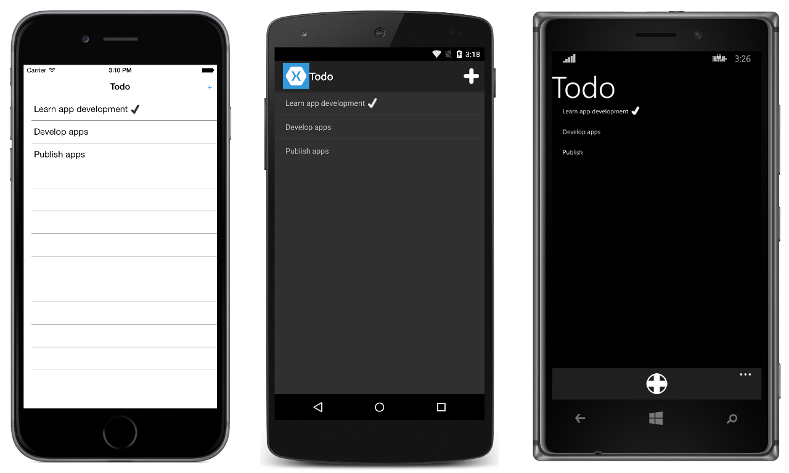

# TodoREST

This sample demonstrates a Todo list application where the data is stored and accessed from a RESTful web service. The web service code is in the TodoAPI project.

The app functionality is:

- View a list of tasks.
- Add, edit, and delete tasks.
- Set a task's status to 'done'.

In all cases the tasks are stored in an in-memory collection that's accessed through a RESTful web service.

For more information about the sample see [Consuming a RESTful Web Service](http://developer.xamarin.com/guides/cross-platform/xamarin-forms/web-services/consuming/rest/).

