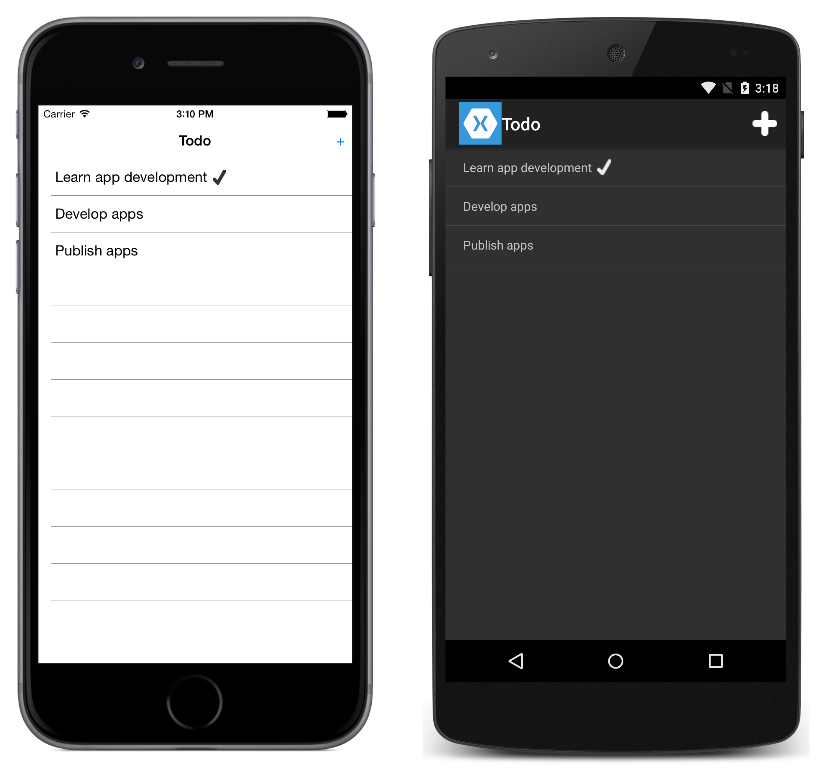

# TodoWCF

This sample demonstrates a Todo list application where the data is stored and accessed from a WCF web service. The web service, included in the solution, is run locally. Connecting emulators, simulators or physical devices to the service may require special configuration. For information see [Configure remote access to IIS Express](https://docs.microsoft.com/xamarin/xamarin-forms/data-cloud/consuming/wcf#configure-remote-access-to-iis-express).

The app functionality is:

- View a list of tasks.
- Add, edit, and delete tasks.
- Set a task's status to 'done'.

In all cases the tasks are stored in an in-memory collection that's accessed through a WCF web service.

For more information about the sample see [Consuming a Windows Communication Foundation (WCF) Web Service](http://developer.xamarin.com/guides/cross-platform/xamarin-forms/web-services/consuming/wcf/).

## Author

David Britch
