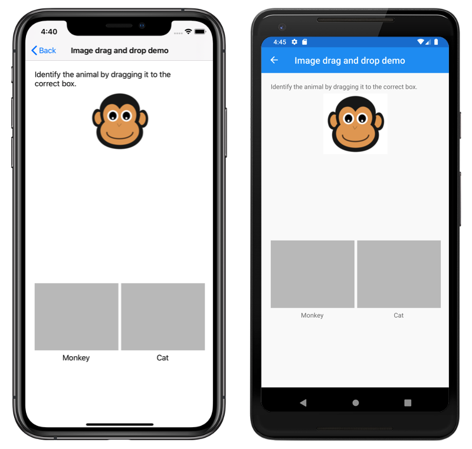

# Drag and Drop Gesture Recognition

This sample demonstrates how to perform drag and drop gesture recognition in Xamarin.Forms applications, with the `DragGestureRecognizer` and `DropGestureRecognizer` classes.

For more information about this sample, see [Add drag and drop gesture recognizers](https://docs.microsoft.com/xamarin/xamarin-forms/app-fundamentals/gestures/drag-drop/).

