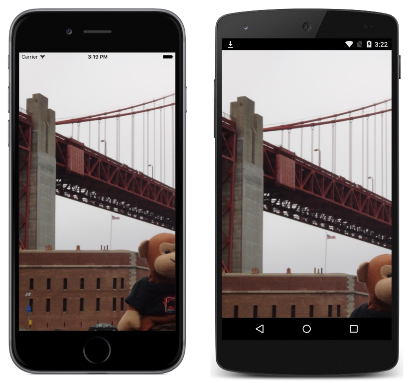

# PanGesture

This sample demonstrates using the `PanGestureRecognizer` class to implement dragging.

For more information about the sample see [Adding a Pan Gesture Recognizer](https://docs.microsoft.com/xamarin/xamarin-forms/app-fundamentals/gestures/pan).

## Author

David Britch
