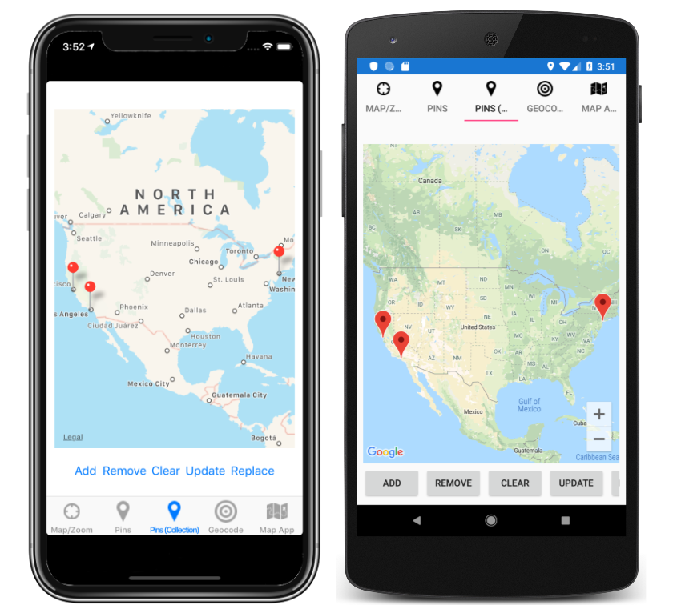

# Working with maps in Xamarin.Forms

The `Map` control displays a map, and requires the Xamarin.Forms.Maps NuGet package.

For more information, see [Xamarin.Forms Map](https://docs.microsoft.com/xamarin/xamarin-forms/user-interface/map).

