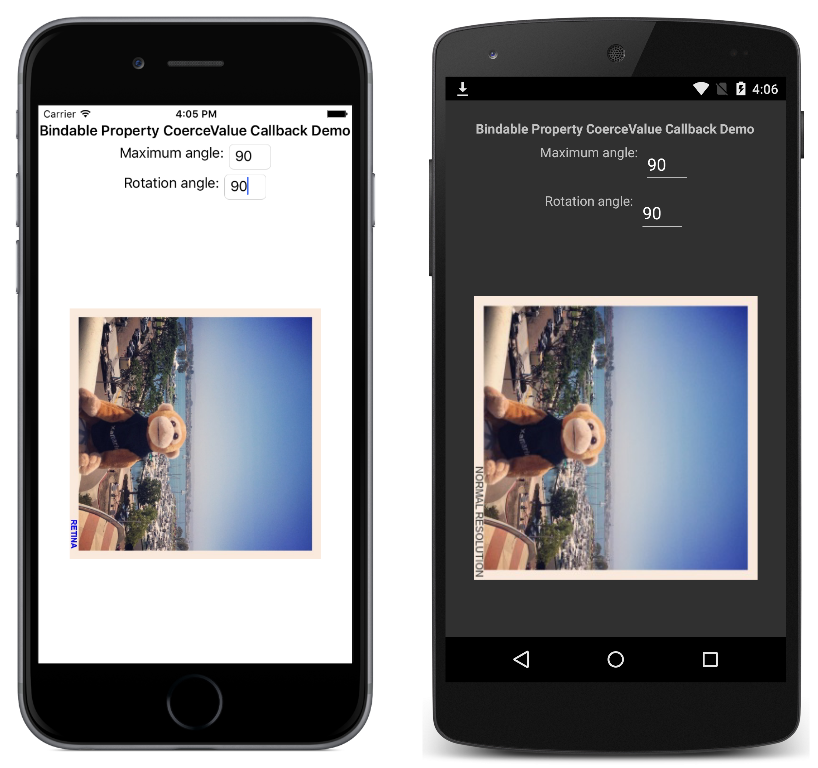

# Coerce Value Callback in Xamarin.Forms

A bindable property is a special type of property, where the property's value is tracked by the Xamarin.Forms property system. This sample demonstrates using a coerce value callback to force a re-evaluation of a bindable property when the value of the property changes.

For more information about this sample, see [Bindable Properties](https://docs.microsoft.com/xamarin/xamarin-forms/xaml/bindable-properties).

