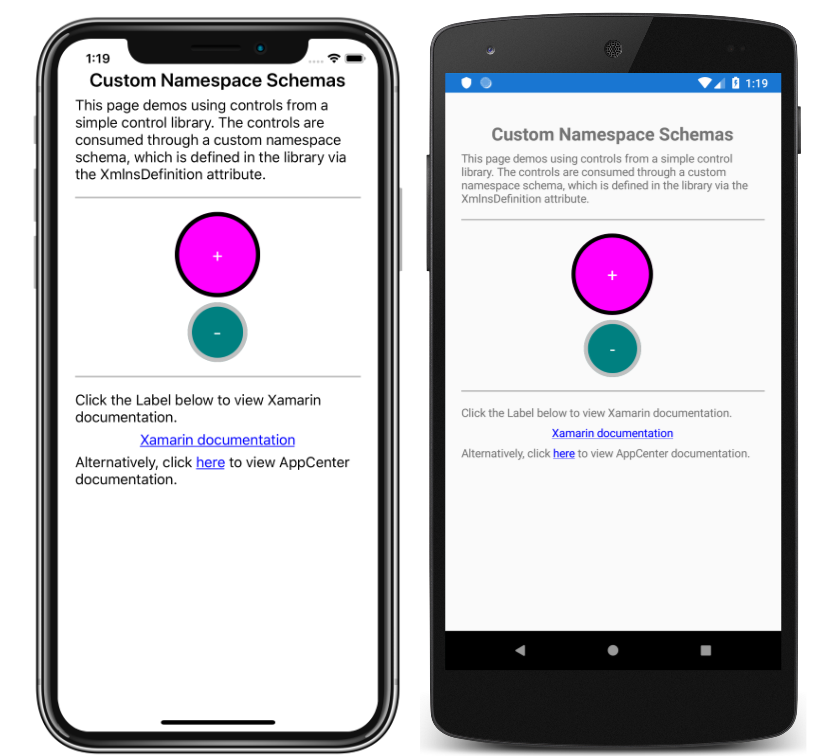

# Custom XAML Namespace Schemas

This sample demonstrates defining and consuming a custom namespace schema, which specifies a mapping between a custom URL and one or more CLR namespaces.

For more information about this sample see [XAML Custom Namespace Schemas in Xamarin.Forms](https://docs.microsoft.com/xamarin/xamarin-forms/xaml/custom-namespace-schemas/).

