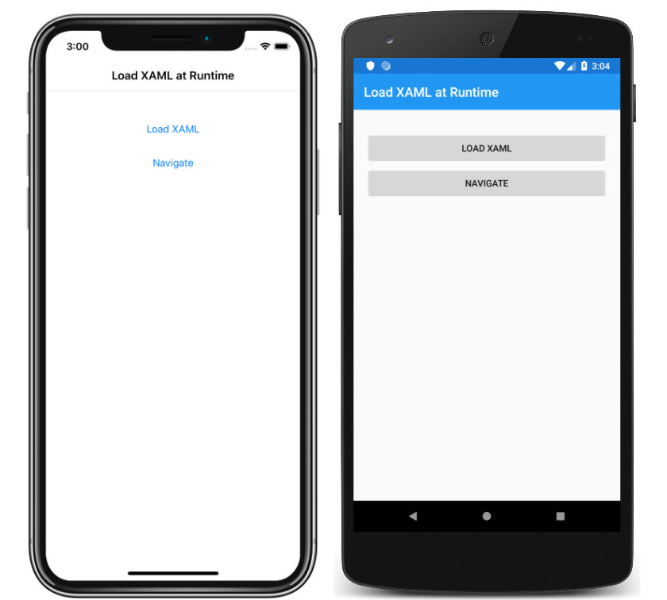

# Load Xamarin.Forms XAML at runtime

This sample demonstrates using the `LoadFromXaml` extension method to load, parse, and display XAML at runtime.

For more information about this sample, see [Loading XAML at Runtime](https://docs.microsoft.com/xamarin/xamarin-forms/xaml/runtime-load).

## Author

David Britch
