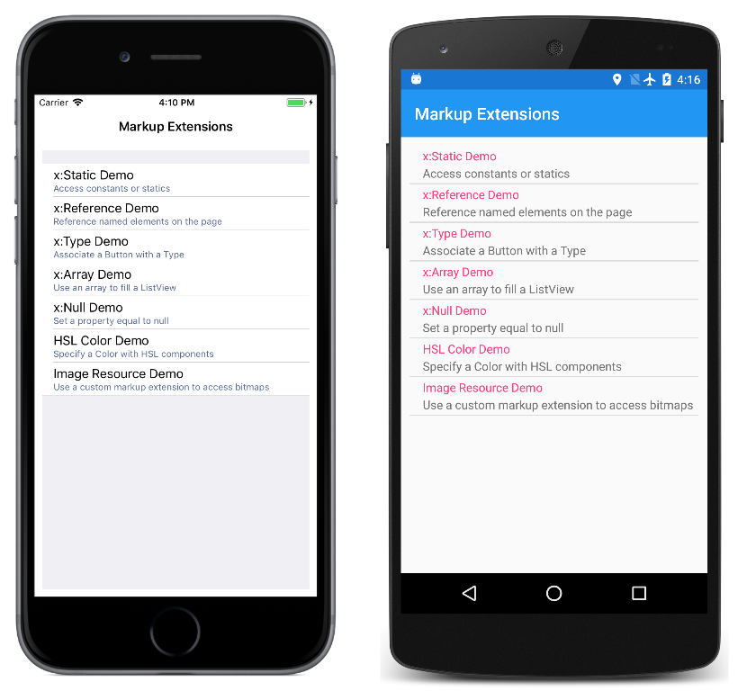

# Markup Extensions in Xamarin.Forms XAML

This sample demonstrates how to use the various XAML markup extensions in Xamarin.Forms, and how to create your own.

For more information about this code, see the article [XAML Markup Extensions](https://docs.microsoft.com/en-us/xamarin/xamarin-forms/xaml/markup-extensions/).

