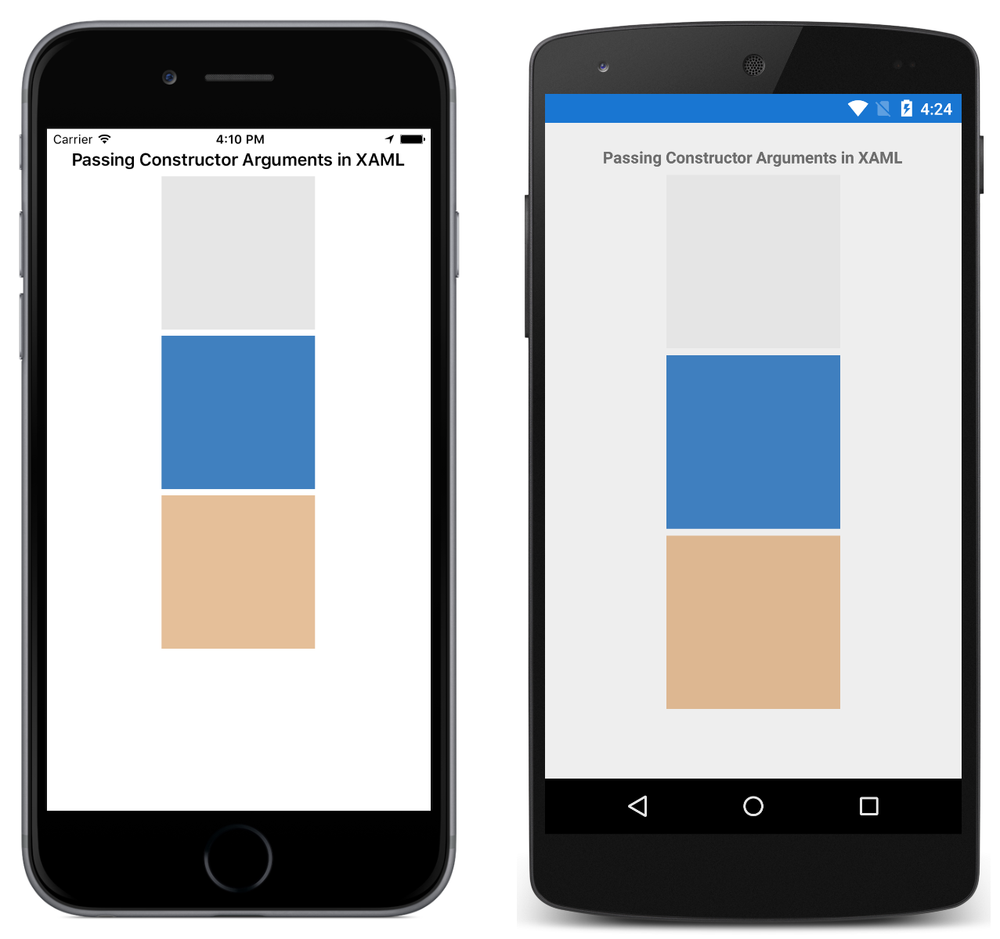

# Passing constructor arguments in Xamarin.Forms XAML

This sample demonstrates specifying constructor arguments for a non-default constructor in XAML.

For more information about this sample, see [Passing Arguments in XAML](https://docs.microsoft.com/xamarin/xamarin-forms/xaml/passing-arguments).

