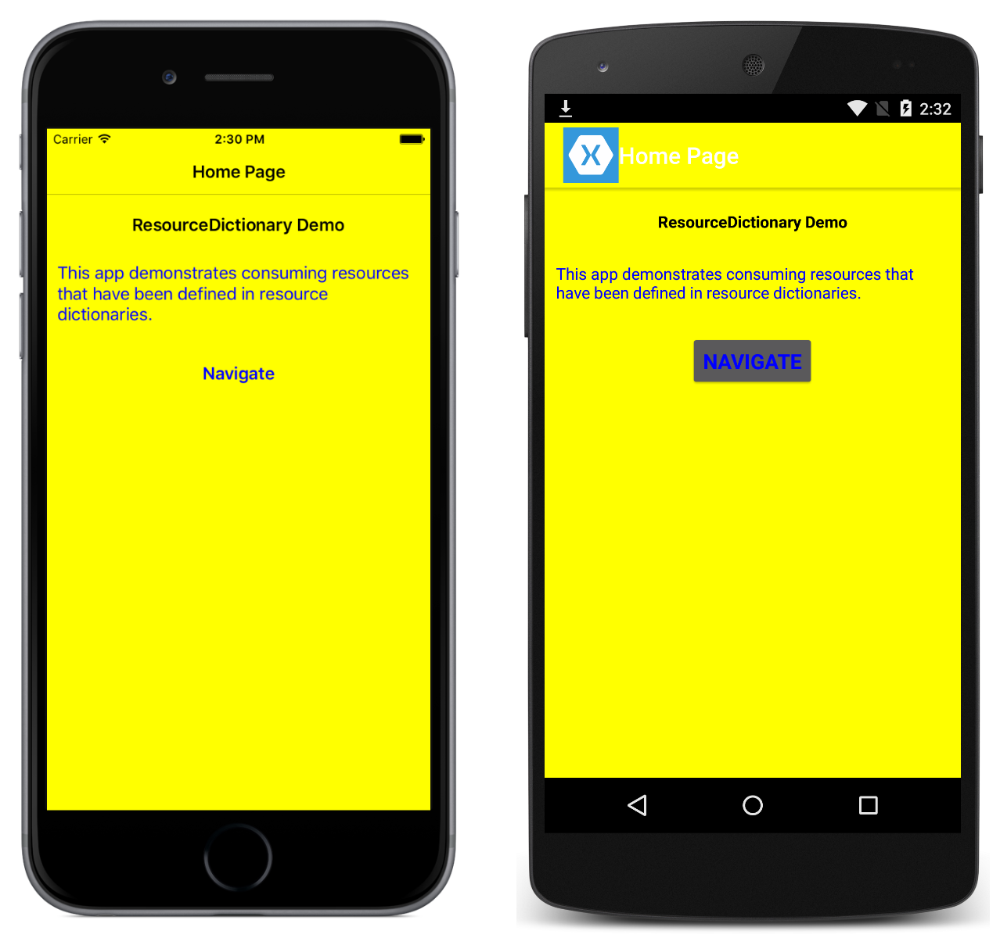

# Resource Dictionaries in Xamarin.Forms

This sample demonstrates creating and consuming a ResourceDictionary at different levels.

For more information about the sample see [Resource Dictionaries](https://docs.microsoft.com/xamarin/xamarin-forms/xaml/resource-dictionaries).

