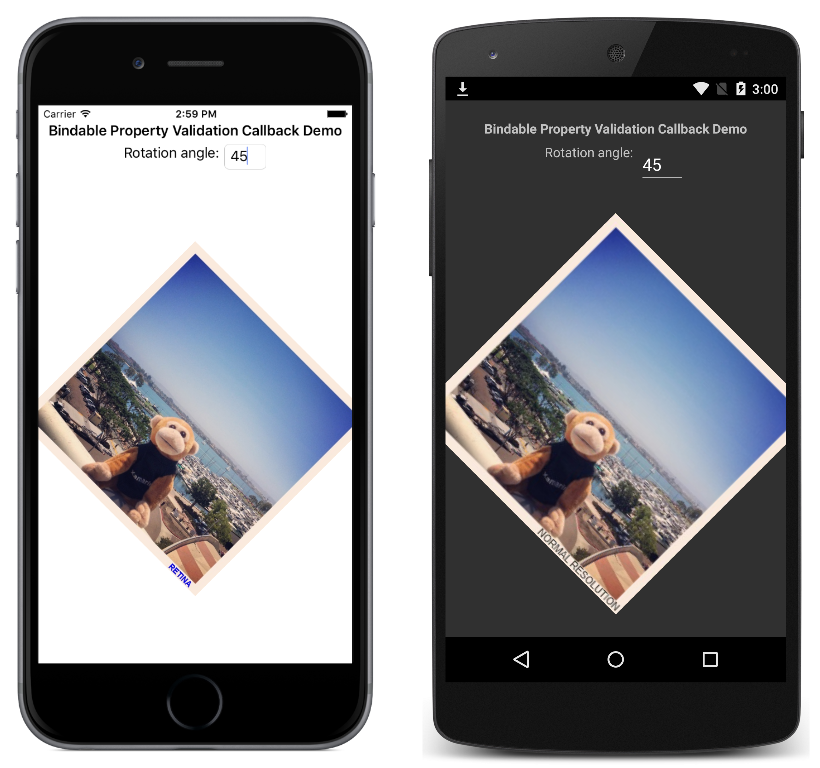

# Validation Callback

A bindable property is a special type of property, where the property's value is tracked by the Xamarin.Forms property system. This sample demonstrates using a validation callback to validate the value of a bindable property.

For more information about this sample, see [Bindable Properties](https://docs.microsoft.com/xamarin/xamarin-forms/xaml/bindable-properties).

## Author

David Britch
